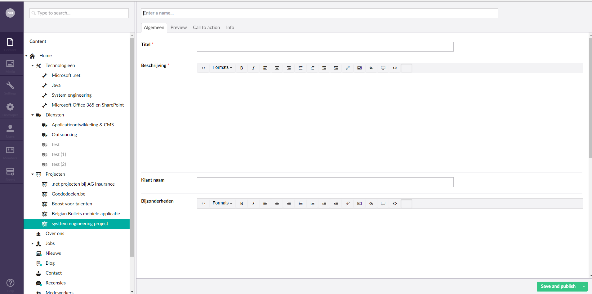
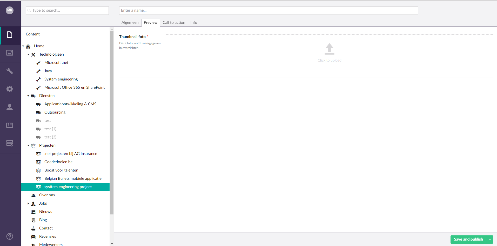
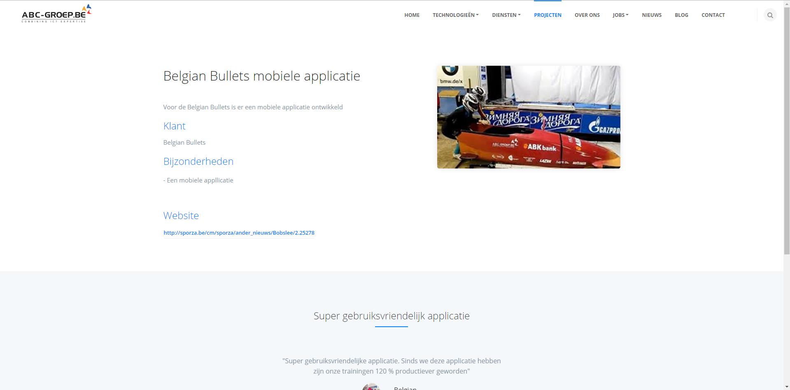

## Image slider:  
Dit is het eerste wat de bezoekers te zien krijgen als ze op onze website komen. De slider sectie is het eerste onderdeel dat in het oog springt. 
Hierop kan het bedrijf zelf slides instellen die navigaren naar een achterliggende pagina op de website.
De doorverwijspagina, de achtergrondafbeelding, de titel en de subtitel zijn in te stellen vanuit de CMS.

Dit is de weergave van hoe deze sectie eruit ziet op het backend gedeelte. De umbraco backoffice word hier getoond.
Hier worden slides ingesteld. De slides verwijzen ook door naar een specifieke pagina. Dit kan in theorie elke pagina van de website zijn. In de praktijk zal hiervoor een landingspagina aangemaakt worden.
Wat een landingspagina juist inhoudt wordt later toegeligd.

Voor het selecteren van een image zal er een apart venster getoond worden waaruit je uit verschillende images kan kiezen die geupload zijn bij de media sectie van Umbraco.

Een volledig ingevuld slider item zal er dan als volgt uitzien

## Bedrijfsnoden: 

Via Umbraco backoffice kun je per pagina de specifieke bedrijfsnoden instellen. De bedrijfsnoden moeten wel eerst aangemaakt zijn onder de umbraco sectie "Bedrijfsnoden". 

Hier worden de bedrijfsnoden getoond op de website (de frontend). De bedrijfsnoden dienen voor het aantrekken van mogelijke klanten, met andere woorden bedrijven die op zoek zijn naar Java, .NET of sharepoint consultants. De bedoeling is dat als deze klanten op zoek gaan naar een oplossing voor hun bedrijfsnoden, zij via een zoekmachine makkelijk op deze website gaan terechtkomen, door SEO (search engine optimization) hoopt het bedrijf ABC-Groep meer bezoekers te trekken.

De bedrijfsnoden stel je in door een item te kiezen dat is aangemaakt onder de bedrijfsnoden sectie. Doormiddel van een selection picker op de specifieke pagina waar je bedrijfsnoden wil aanmaken zal je uit de verschillende bedrijfsnoden kunnen kiezen die aangemaakt zijn onder bedrijfsnoden.

Voor het instellen van bedrijfsnoden op de homepagina dien je eerst te zien dat er bedrijfsnoden zijn aangemaakt onder de bedrijfsnoden sectie.
Voor het kiezen van de bedrijfsnoden maak je gebruik van de property “Weer te geven bedrijfsnoden”
Vervolgens als je bij dit element op “Add” drukt zullen aan de rechterzijde van het scherm al de bedrijfsnoden getoond worden die aangemaakt zijn onder de bedrijfsnoden sectie. Als er niks wordt ingesteld zullen alle bedrijfsnoden worden weergegeven die aangemaakt zijn. 
De bedrijfsnoden die getoond moeten worden op de specifieke pagina (in dit geval de homepagina) worden hier aangevinkt en uiteindelijk dient de pagina opgeslagen te worden.

Voor het aanmaken van een bedrijfsnood item of pagina wat in dit geval hetzelfde is dien je naar de bedrijfsnoden sectie te navigeren. Hieronder kan je een nieuwe bedrijfsnood aanmaken.

Zoals getoond in deze afbeeldding kan je door op het bedrijfsnodenoverzicht te rechterklikken een bedrijfsnood aanmaken.

Zoals op elke pagina geef je eerst een titel en een Beschrijving mee.
De titel "Bedrijfsnoden" kun je instellen onder de pagina "bedrijfsnoden". 
Vervolgens heb je een feature block die je kan invullen. Deze featureblock is optioneel. Vul je niets in dan zal er ook geen featureblock getoond worden. De mogelijkheid bestaat ook om meer dan 1 featureblock aan te maken indien gewenst. Dan zullen deze featureblocks onder elkaar getoond worden. Meer informatie over featureblocks volgt later in de scriptie.

## Oplossingen: 
Hier worden de verschillende oplossingen getoond. Net zoals bij de projecten en bedrijfsnoden kan je via de umbraco backoffice instellen welke oplossingen er getoond worden. 
Voor het instellen van oplossingen heb je net zoals bij bedrijfsnoden een selection picker. Deze selection picker wordt voorzien op alle pagina’s waarop bedrijfsnoden getoond moeten worden.

De verschillende oplossingen dienen ook wel eerst aangemaakt te worden onder de umbraco pagina "Oplossingen". Op vraag van de project manager is het zo geprogrameerd dat als er geen oplossingen ingesteld worden alle oplossingen getoond zullen worden.

Het aanmaken van een oplossing gebeurt gelijkaardig aan het aanmaken van een bedrijfsnood. Een titel en een beschrijving dienen verplicht ingesteld te worden. Als de websitebouwer dit niet invuld zal Umbraco automatisch het in te vullen veld aanduiden en zal het niet mogelijk zijn de pagina te saven en te publishen vooraleer deze velden worden ingevuld. Verder kunnen er featureblocks aangemaakt worden. Op de oplossingen detailpagina dient er ook een recensie titel ingesteld te worden en daaronder kan je door middel van een selectionpicker Recensies selecteren. Je kan dan kiezen uit alle recensies die aangemaakt zijn onder de umbraco sectie recensies. Hoe recensies worden aangemaakt wordt later nog toegelicht in de scriptie. Een bedrijfsnood is altijd gekoppeld aan 1 of meerdere oplossingen. Voor 1 bedrijfsnood kunnen er meerdere oplossingen zijn, maar 1 oplossing heeft slechts 1 bedrijfsnood. Concreet wil dit zeggen dat je in de bedrijfsnood detailpagina 1 of meerdere oplossingen kan kiezen. Er is dan voor gekozen om deze koppeling weg te laten uit de oplossing detailpagina. Omdat dit alleen voor verwarring en dubbel werk zou zorgen voor de website bouwer.

## Projecten: 

Hier worden de projecten getoond op de frontend. De projecten maak je aan in de Umbraco backoffice onder de sectie “projecten”
 
Voor deze projecten in stellen in de umbraco backoffice dient er een titel en een beschrijving opgegeven te worden. Verder kan er ook een naam van een klant ingesteld worden. Een bijzonderheden veld is ook voorzien. Hierop kan de websitebouwer de bijzonderheden van het project toelichten.

Verder kan er een website adres ingesteld worden, zodat er vanuit de projectpagina naar het desbetreffend project kan navigeren (indien het desbetrefende project online staat en een website betreft)
De mogelijkheid bestaat om recensies mee te geven om het project extra in de verf te zetten. Deze recensies dienen ook eerst aangemaakt te worden in de umbraco backoffice (later meer hierover) Ten slotte kunnen er ook vacatures ingesteld worden op deze backoffice. Navigeren naar pagina’s binnen de website is altijd goed. Dit verhoogt de stickyness van de website waardoor de bezoekers langer blijven en meer pagina’s bezoeken.

Onder de Preview tab in de umbraco backoffice kunnen er ook enkele images per project ingesteld worden. Deze images worden geupload van je lokale harde schijf, dus niet van de umbraco media sectie.

Deze images zullen aan de rechterkant van de project detail pagina weergeven worden. In dit geval is er slechts 1 image ingesteld. Indien er meer images ingesteld worden zullen deze onder elkaar weergegeven worden.

Voor het instellen van de projecten die op een pagina weergegeven dienen te worden kan je de projecten om weer te geven kiezen door op "Add" te klikken. Als je de projecten hebt aangeduid dan save & publish je de pagina zodat de wijzingen opgeslagen en op de frontend weergegeven zullen worden.

Je kan kiezen uit de pagina's die onder de pagina "projecten" staan. Dus het type pagina dat we juist hebben aangemaakt. De volgorde kan eventueel achteraf nog veranderd worden door de items te verslepen en van plaats te verwisselen.

## Recensies: 

Hier worden de recensies getoond, er kan ook ingesteld worden welke recensies er getoond moeten worden in de umbraco backoffice.

Voor het aanmaken van recensies dient er naar de recensies pagina genavigeerd te worden in de umbraco backoffice. Door het rechterklikken op dit element kan je een recensie aanmaken. De velden die ingevuld dienen te worden bij een recensie zijn: De naam van de recensent, het citaat ( wat hij zegt ) en ten slotte dient er een foto van de recensent geupload te worden.
Voor het instellen van de recensies op de pagina’s waar dit voorzien is, dien je door middel van een selection picker de recensies te selecteren die getoond mogen worden. Door middel van een control van de template zullen deze recensies in een carousel getoond worden.

## Preview: 
De preview is een umbraco sectie. In deze tab geef je een verkorte beschrijving die in het overzicht gebruikt wordt.
Deze overzichten zijn de overzichten van de projecten en het overzicht van de oplossingen, ook de technologie overzicht pagina maakt gebruik van een preview.

## Feature blocks: 
Je kunt 1 of meerdere beschrijvingen per feature ingeven. Als er meerdere beschrijvingen opgegeven zijn zullen deze in tabs weergegeven worden. 
Eerst was er voorzien dat je per featureblock slechts 1 video of image kon toevoegen. Naderehand bleek het logischer dat een video of een filmpje gelinkt werd aan een specifieke tab. Dit hebben we dan aangepast zodat als je op een andere tab drukt zowel de tekst als de image of video zal veranderen.

Beschikbare oplossingen: je kunt kiezen welke oplossingen beschikbaar zijn voor deze technologie. Als er geen zijn opgegeven, zijn alle oplossingen beschikbaar voor deze technologie.

## Ons team: 

stel hier de titel in en de medewerkers die moeten worden weergegeven. Eerst moeten er wel medewerkers aangemaakt zijn.
Om medewerkers aan te maken: ga je eerst naar de pagina "Medewerkers" en klik je op "Create team lid" en stel je allerlei gegevens in. 
De gegevens die ingevuld dienen te worden zijn de naam van het teamlid, een afbeelding, de functie die ze uitoefenen in het bedrijf. Optioneel kan er nog een linkedIn, twitter en email worden ingesteld. Als deze zijn ingesteld zal het ook makkelijk zijn om via de site deze persoon te contacteren of zijn linkedIn te bezoeken door op deze icoontjes te klikken. Bij de mail zal automatisch het mailprogramma openen dat standaard geinstalleerd is op de computer van de bezoeker. De linkedIn en de twitter links zullen gewon doorverwijzen naar de desbetreffende pagina van het teamlid.

Op de pagina's waar het voorzien is zal je door middel van een selection picker de werknemers kunnen instellen die je onder deze sectie hebt aangemaakt. Een lijst zal dan getoond worden met alle beschikbare werknemers. Degene die je wil tonen kan je dan aanvinken

## Nieuws artikel

In het nieuwsoverzicht zullen vanzelfsprekend de nieuwsartikels op aanmaakdatum gesorteerd worden, waarbij de nieuwste als eerste getoond zullen worden. 
TODO Nieuws OVERZICHT FOTO!

Om een nieuws artikel aan te maken druk je op "Create nieuws artikel"
Voor het invullen van een nieuwsartikel dient er logischerwijs een titel ingegeven te worden. Verder heb je het Artikel zelf deze is uitgerust met een richtext editor; Dit zorgt ervoor dat je opmaak kan meegeven aan het artikel. Je zal headers, spacing, bold, italic,... optioneel kunnen meegeven aan de tekst waardoor je het artikel perfect in de backend kan schrijven, zonder gebruik van een word programma. Verder was er ook een bug met het plakken van tekst vanuit een word artikel, hiervoor hebben we een item toegevoegd dat een word converteerd naar plain-tekst. Verder is er ook de optie voorzien zodat er eventueel code samples in een artikels geplaats kunnen worden. Je kan dan selecteren om welke programmeertaal het gaat, deze property zal dan automatisch de programeer syntax laden en deze tonen zodat het echt als een code sample getoond wordt.
TODO FOTO SYNTAX HIGHLIGHTER
FOTO NIEUWS DETAIL TODO!
De titel van het artikel en het artikel zelf worden in een kolom links weergegeven. De foto's worden in de rechterkolom weergegeven. De foto's kunnen herschikt worden door ze te verslepen. De eerste foto in de lijst is tevens de foto die in de nieuws detailpagina als eerste zal worden weergegeven. De foto’s die je daarna instelt zullen onder de eerste foto weergegeven worden.

## Call to action: 
om de call to action in te stellen begeef je je naar het tabje in de umbraco backoffice "Call to action". Bij "Formulier" geef je de verkregen HTML snippet van clickdimensions op. Deze HTML-code zal door HR gegenereerd moeten worden. Zij kiezen dan welke veldjes en in beperkte mate welke opmaak er meegegeven wordt. Belangrijk is dat alle links in de snippet zeker https zijn, anders zal het formulier door security issues niet geladen worden. De webserver zal blokkeren dat dit geladen wordt.

## Vacatures: 

stel hier de vacatures om weer te geven in. Deze vacatures dienen ook aangemaakt te worden onder de umbraco pagina "Jobs".

## Landingspagina

Een landingspagina is een pagina die de websitebouwer aanmaakt en zelf kan instellen. Deze pagina maakt gebruikt van een grid, zodat er zowel afbeeldingen als teksten of eventueel een youtube video ingesteld kan worden. Er zijn ook verschillende lay-outs voorzien voor de website bouwer om uit te kiezen. Bijvoorbeeld 3 kolommen, 2 kolommen,...

## Navigatie

De navigatie is een tab op de backend die bij bijna alle pagina’s geimplementeerd is. Door deze tab zal je kunne kiezen of deze dient weergeven te worden in de navigatie. Voor de meeste pagina’s zal dit vanzelfsprekend en logisch zijn, maar er kan eventueel ook een landingspagina aangemaakt worden voor een specifieke actie van korte duur. Deze dient dan niet expliciet vermeld te worden in de navigatie maar alleen doorgelinkt te worden door bijvoorbeeld een slider item.
