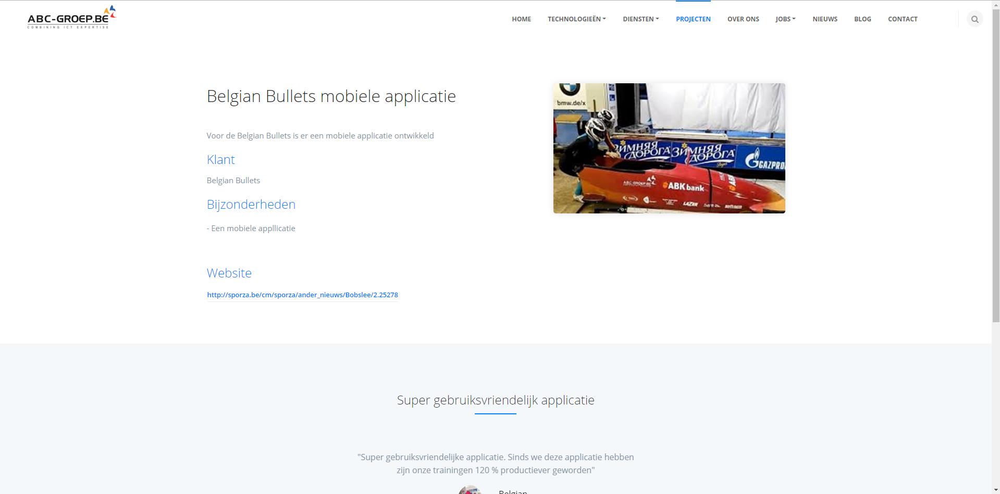

# Projecten: 

## Overzichtpagina

Hier worden de projecten getoond op de frontend. Deze pagina is de overzichtpagina van de aangemaakte projecten. Alle projecten worden hier opgelijst en getoond aan de bezoeker van de website. 

## projectdetailpagina
### Recensies
De mogelijkheid bestaat om recensies mee te geven om het project extra in de verf te zetten. Deze recensies dienen ook eerst aangemaakt te worden in de umbraco backoffice. Later in de scriptie wordt er toegeligt hoe recensies aangemaakt dienen te worden. 

### Vacatures 
Ten slotte kunnen er ook vacatures ingesteld worden. De mogelijkheid geven aan de websitebezoeker om naar pagina’s binnen binnen de website te navigeren is altijd goed. Dit verhoogt de stickyness van de website waardoor de bezoekers langer blijven en meer pagina’s bezoeken.

### Images

Deze images zullen aan de rechterkant van de project detail pagina weergeven worden. In dit geval is er slechts 1 image ingesteld. Indien er meer images ingesteld worden zullen deze onder elkaar weergegeven worden.

